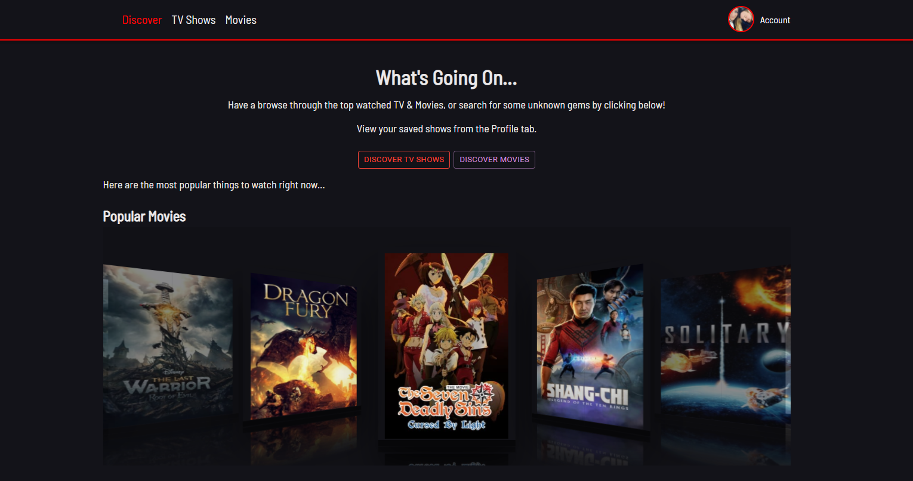
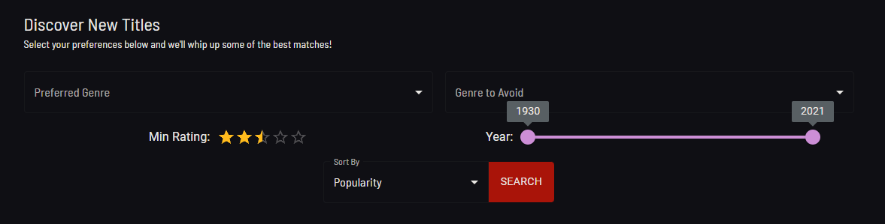
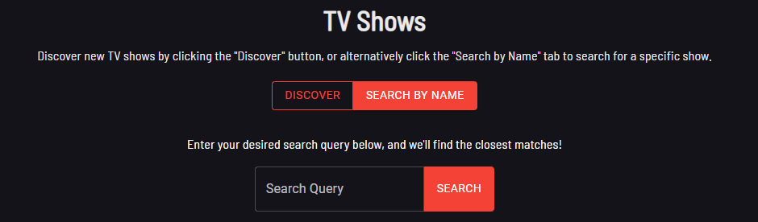

# Lets Watch

## Table of Contents
  - [General Information](#general-information)
  - [Installation](#installation)
  - [Usage](#usage)
  - [Discovering New Shows](#discovering-new-shows)
  - [Technologies](#technologies)
  - [Status](#status)
  - [Todo](#todo)

## General Information

Let's Watch is an app which allows you to search for TV shows and movies via the TMDB API, and save them to your watch list for later.

You can browse the top watched TV shows and movies at a glance, or you can discover new hidden gems via the discover form where you can search via preferred/avoided genres, minimum ratings and date released etc.
## Installation

If you are looking to view/make changes to the existing codebase, then cloning the repository is the best way to achieve this. 

To do this navigate to a suitable directory, and run `git clone https://github.com/jamesgower/lets-watch.git` from the terminal. 

Once the repository is cloned, you can navigate to the repository and run `npm install` to install all of the dependencies. To run the application, you can run `npm run dev` from the root directory, and a local version of the can be accessed from accessing localhost:3000 from your browser.

## Usage

To use the application, it can be accessed from 
[this](https://master.d2qa9ouq71v6zu.amplifyapp.com/) link (https://master.d2qa9ouq71v6zu.amplifyapp.com/), or by installing it with the above method.

## Discovering New Shows

### Discover Form

To discover new TV shows or Movies you need to first navigate to the relevant page (/movies or /tv-shows) and click the "Discover" tab at the top of the page.

The form (as shown below) can be filled in to filter through all of the possible results.

### Search by Name

If you have a specific show that you would like to search for - either to add it to your saved shows, or to just look up the rating or overview of the show - you can search for it by clicking the "Search by Name" tab.

## Technologies

- React 17
- Redux 
- TypeScript
- AWS Amplify
- AWS AppSync (GraphQL)
- AWS Cognito
- AWS DynamoDB
- AWS S3
- Material UI (MUI)
- Axios
- TMDB API
- SCSS
- Webpack 5
## Status

The application is in a working state, but there are features which need to be implemented to be considered a finished product. Updates will be made in due course.

## Todo

- Testing needs to be refactored and uploaded since refactoring and upgrading the application.
- Different ways to search the API need to be added.
- Genres should be searchable on click of their respective tags
- Carousel scroll feature is broken in react-carousel, fix and send PR.

